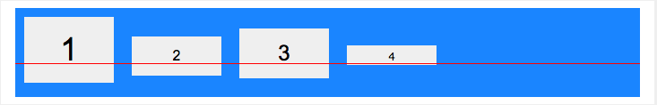
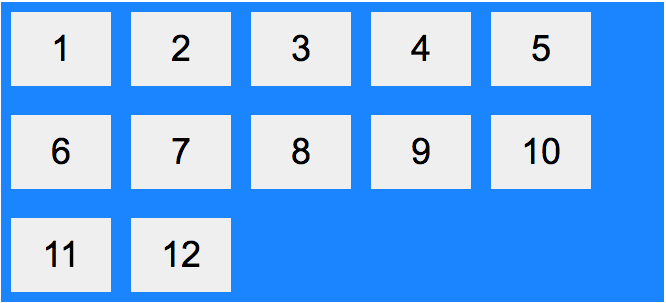

# Flexbox

# CSS Flexbox

## Flexbox Elements

To start using the Flexbox model, you need to first define a flex container.

```html
<div class="flex-container">
  <div>1</div>
  <div>2</div>
  <div>3</div>
</div>
```

---

## Parent Element (Container)

The flex container becomes flexible by setting the display property to flex:

```css
.flex-container {
  display: flex;
}
```

The flex container properties are:

- flex-direction
- flex-wrap
- flex-flow
- justify-content
- align-items
- align-content

---

## The flex-direction Property

The `flex-direction` property defines in which direction the container wants to stack the flex items.


The **`column`** value stacks the flex items vertically (from top to bottom):

```css
.flex-container {
  display: flex;
  flex-direction: column;
}
```

The `column-reverse` value stacks the flex items vertically (but from bottom to top):

```css
.flex-container {
  display: flex;
  flex-direction: column-reverse;
}
```

The row value stacks the flex items horizontally (from left to right):

```css
.flex-container {
  display: flex;
  flex-direction: row;
}
```

The row-reverse value stacks the flex items horizontally (but from right to left):

```css
.flex-container {
  display: flex;
  flex-direction: row-reverse;
}
```

---

## The flex-wrap Property

The `flex-wrap` property specifies whether the flex items should wrap or not.

The examples below have 12 flex items, to better demonstrate the `flex-wrap` property.


The wrap value specifies that the flex items will wrap if necessary:

```css
.flex-container {
  display: flex;
  flex-wrap: wrap;
}
```

The nowrap value specifies that the flex items will not wrap (this is default):

```css
.flex-container {
  display: flex;
  flex-wrap: nowrap;
}
```

The wrap-reverse value specifies that the flexible items will wrap if necessary, in reverse order:

```css
.flex-container {
  display: flex;
  flex-wrap: wrap-reverse;
}
```

---

## The flex-flow Property

The `flex-flow` property is a shorthand property for setting both the `flex-direction` and `flex-wrap` properties.

```css
.flex-container {
  display: flex;
  flex-flow: row wrap;
}
```

---

## The justify-content Property

The `justify-content` property is used to align the flex items:


The center value aligns the flex items at the center of the container:

```css
.flex-container {
  display: flex;
  justify-content: center;
}
```

The flex-start value aligns the flex items at the beginning of the container (this is default):

```css
.flex-container {
  display: flex;
  justify-content: flex-start;
}
```

The flex-end value aligns the flex items at the end of the container:

```css
.flex-container {
  display: flex;
  justify-content: flex-end;
}
```

The space-around value displays the flex items with space before, between, and after the lines:

```css
.flex-container {
  display: flex;
  justify-content: space-around;
}
```

The _space-between_ value displays the flex items with space between the lines:

```css
.flex-container {
  display: flex;
  justify-content: space-between;
}
```

---

## The align-items Property

The `align-items` property is used to align the flex items vertically.


In these examples we use a 200 pixels high container, to better demonstrate the `align-items` property.

The _center_ value aligns the flex items in the middle of the container:

```css
.flex-container {
  display: flex;
  height: 200px;
  align-items: center;
}
```

The _flex-start_ value aligns the flex items at the top of the container:

```css
.flex-container {
  display: flex;
  height: 200px;
  align-items: flex-start;
}
```

The _flex-end_ value aligns the flex items at the bottom of the container:

```css
.flex-container {
  display: flex;
  height: 200px;
  align-items: flex-end;
}
```

The stretch value stretches the flex items to fill the container (this is default):

```css
.flex-container {
  display: flex;
  height: 200px;
  align-items: stretch;
}
```

The _baseline_ value aligns the flex items such as their baselines aligns:

```css
.flex-container {
  display: flex;
  height: 200px;
  align-items: baseline;
}
```

**Note:** the example uses different font-size to demonstrate that the items gets aligned by the text baseline:


---

---

---

## The align-content Property

The `align-content` property is used to align the flex lines.



In these examples we use a 600 pixels high container, with the flex-wrap property set to wrap, to better demonstrate the `align-content` property.

The _space-between_ value displays the flex lines with equal space between them:

```css
.flex-container {
  display: flex;
  height: 600px;
  flex-wrap: wrap;
  align-content: space-between;
}
```

The *space-aroun*d value displays the flex lines with space before, between, and after them:

```css
.flex-container {
  display: flex;
  height: 600px;
  flex-wrap: wrap;
  align-content: space-around;
}
```

The _stretch_ value stretches the flex lines to take up the remaining space (this is default):

```css
.flex-container {
  display: flex;
  height: 600px;
  flex-wrap: wrap;
  align-content: stretch;
}
```

The center value displays display the flex lines in the middle of the container:

```css
.flex-container {
  display: flex;
  height: 600px;
  flex-wrap: wrap;
  align-content: center;
}
```

The `flex-start` value displays the flex lines at the start of the container:

```css
.flex-container {
  display: flex;
  height: 600px;
  flex-wrap: wrap;
  align-content: flex-start;
}
```

The _flex-end_ value displays the flex lines at the end of the container:

```css
.flex-container {
  display: flex;
  height: 600px;
  flex-wrap: wrap;
  align-content: flex-end;
}
```

---

---

## Perfect Centering

In the following example we will solve a very common style problem: perfect centering.


**SOLUTION:** Set both the `justify-content` and align-items properties to _center_, and the flex item will be perfectly centered:

```css
.flex-container {
  display: flex;
  height: 300px;
  justify-content: center;
  align-items: center;
}
```
